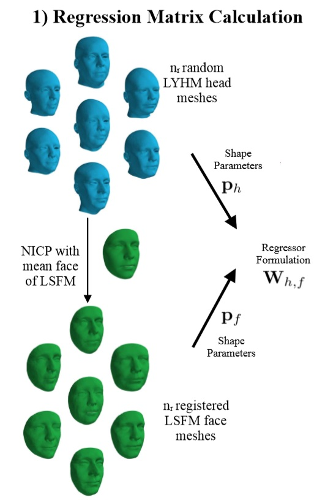

# Combining 3D Morphable Models: A Large scale Face-and-Head Model
This repository provides a MATLAB implementation of the CVPR 2019 Paper - Combining 3D Morphable Models: A Large scale Face-and-Head Model. It is implemented only till the Regression Matrix Calculation part.
<p align="center"></p>

## Paper
[Combining 3D Morphable Models: A Large scale Face-and-Head Model](https://arxiv.org/abs/1903.03785)

## Dependencies
* [MATLAB](https://www.mathworks.com/downloads/)

## Usage
### 1. Cloning the repository
```
git clone https://github.com/nabeel3133/combining3Dmorphablemodels.git
```

### 2. Downloading the models
- [Liverpool York Head Model: LYHM](https://www-users.cs.york.ac.uk/~nep/research/LYHM/)
  - After you have acquired LYHM, extract the lyhmPublic.zip and go to "lyhmPublic/lyhmModels/", copy "LYHM_male.mat" and place it in the "Regression Matrix Calculation" folder.
- [Basel Face Model 2009: BFM](https://faces.dmi.unibas.ch/bfm/index.php?nav=1-1-0&id=details)
  - After you have acquired BFM, extract the BaselFaceModel.tgz and go to "PublicMM1" folder, copy "01_MorphableModel.mat" and place it in the "Regression Matrix Calculation" folder.
  
### 3. Running the code


### 4. Testing


## Citation
If this work is useful for your research or if you use this implementation in your academic projects, please cite the following papers:
- [Combining 3D Morphable Models: A Large Scale Face-And-Head Model](https://arxiv.org/abs/1903.03785)
```bibtex
@InProceedings{ploumpis2019combining,
author = {Stylianos Ploumpis and Haoyang Wang and Nick Pears and William A. P. Smith and Stefanos Zafeiriou},
title = {Combining 3D Morphable Models: A Large Scale Face-And-Head Model},
booktitle = {The IEEE Conference on Computer Vision and Pattern Recognition (CVPR)},
month = {June},
year = {2019}
}
```

- [Optimal Step Nonrigid ICP Algorithms for Surface Registration](https://gravis.dmi.unibas.ch/publications/2007/CVPR07_Amberg.pdf):
```bibtex
@InProceedings{amberg2007optimal,
  title={Optimal Step Nonrigid ICP Algorithms for Surface Registration},
  author={Amberg, Brian and Romdhani, Sami and Vetter, Thomas},
  booktitle={Computer Vision and Pattern Recognition, 2007. CVPR'07. IEEE Conference on},
  pages={1--8},
  year={2007},
  organization={IEEE}
}
```
